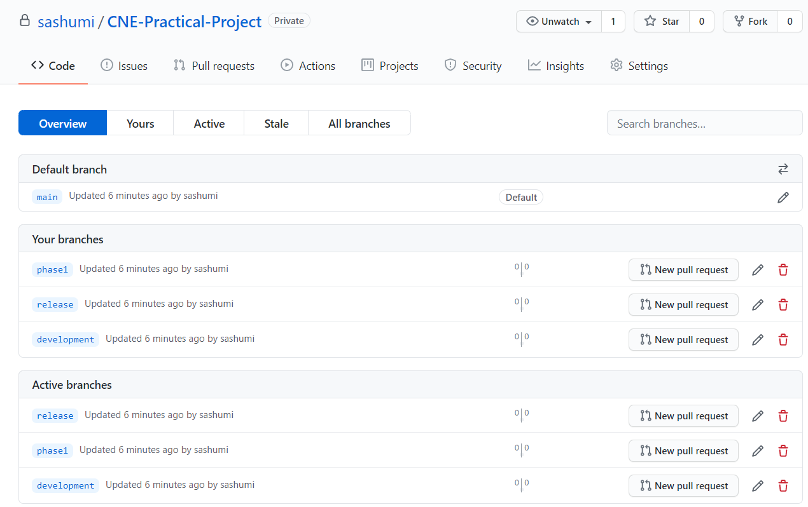
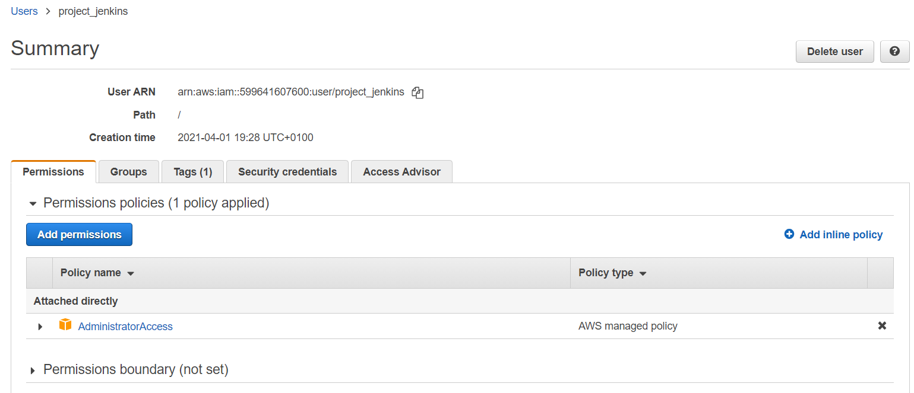
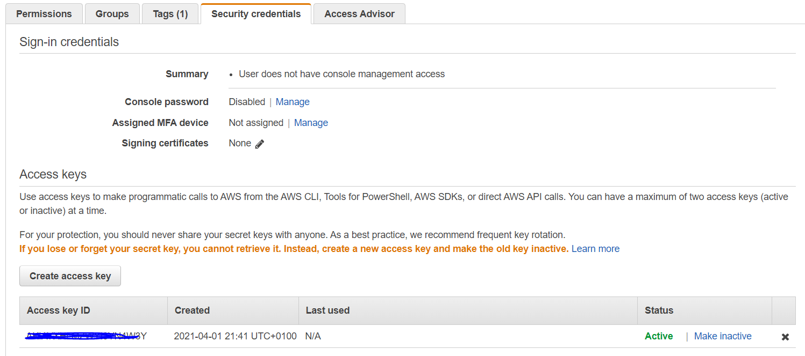
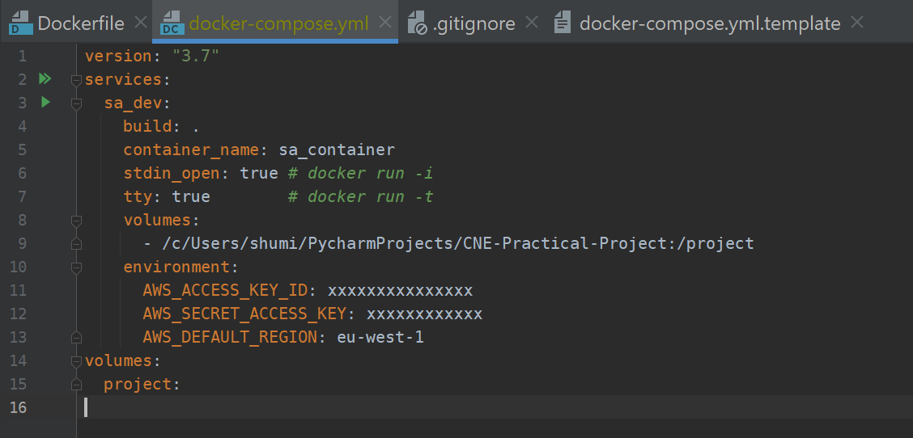
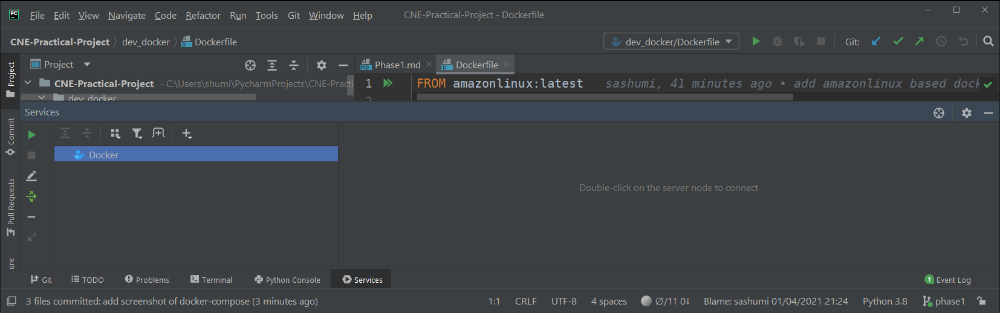
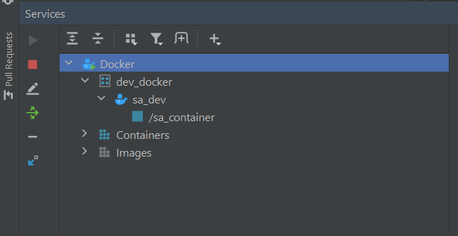

At this point, I run the following

```markdown
docker-compose up -d
```


```markdown

Successfully built 6d4326de1789f8e54c3e7b405e81bc42532451fc0058ee7c9d450b884c2626a5
WARNING: Image for service sa_dev was built because it did not already exist. To rebuild this image you must use `docker-compose build` or `docker-compos
e up --build`.
Creating sa_container ... error
```
however, since I had already created another container with same name in the past, it threw error.

```markdown
ERROR: for sa_container  Cannot create container for service sa_dev: Conflict. The container name "/sa_container" is already in use by container "a61e6ec
d98ee7621b4e6d8f6fe0d9be0a4bc411ff371e6e57cf9eb5e51a4eaf1". You have to remove (or rename) that container to be able to reuse that name.

ERROR: for sa_dev  Cannot create container for service sa_dev: Conflict. The container name "/sa_container" is already in use by container "a61e6ecd98ee7
621b4e6d8f6fe0d9be0a4bc411ff371e6e57cf9eb5e51a4eaf1". You have to remove (or rename) that container to be able to reuse that name.
ERROR: Encountered errors while bringing up the project.
```

The solution was to remove the similarly named container and re-run the docker-compose.

```markdown
C:\Users\shumi\PycharmProjects\CNE-Practical-Project\dev_docker>docker ps -a
CONTAINER ID   IMAGE              COMMAND       CREATED        STATUS                      PORTS     NAMES
a61e6ecd98ee   sa_docker_sa_dev   "/bin/bash"   46 hours ago   Exited (255) 21 hours ago             sa_container

C:\Users\shumi\PycharmProjects\CNE-Practical-Project\dev_docker>docker rm -f sa_container
sa_container

C:\Users\shumi\PycharmProjects\CNE-Practical-Project\dev_docker>docker-compose up -d
Creating network "dev_docker_default" with the default driver
Creating sa_container ... done

C:\Users\shumi\PycharmProjects\CNE-Practical-Project\dev_docker>

```

# How to find the docker container using GUI?

By pressing 'Alt+8' the Docker service console is opened on Pycharm.


As default, we only see the word Docker and a green play button. Once clicked, we then can see current docker containers.



